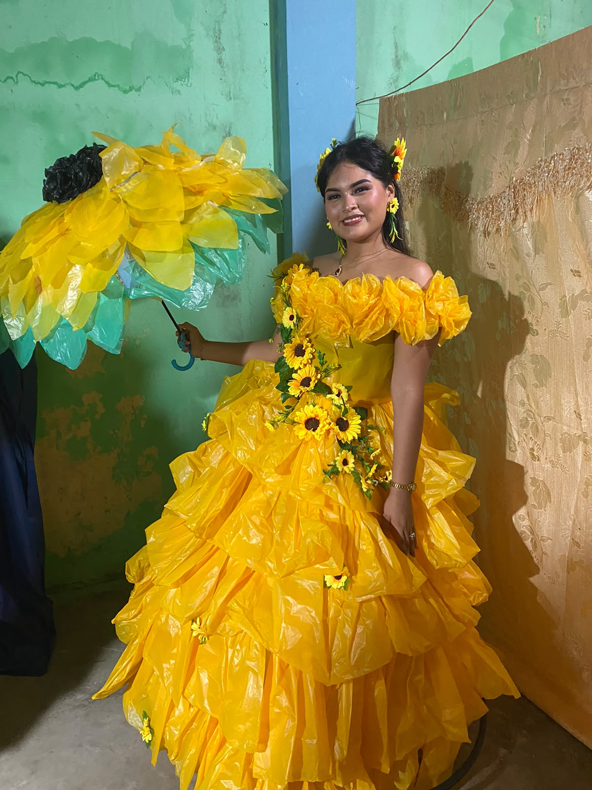

<html>
<head>
    <meta charset="UTF-8">
    <meta
        name="viewport"
        content="width=device-width, initial-scale=1.0"
    >
    <title>Para mi Dannita 💛</title>
    <!-- CONEXIÓN CON EL CSS -->
    <link rel="stylesheet" href="style.css">
</head>
<body>

    

    

   

    <main class="contenido">
        <section class="titulo">
            

                💛
            

            <h1>
                PARA TI MI DANNITA HERMOSA
            </h1>
            

                Un pequeño detalle hecho especialmente para ti
                🌻✨
            

        </section>
        <section class="zona-ramo">
           

                

                

                

                

                

                

                

                

                

                

                

                

                

                

                

                

                

                    

                        
                        

                            💛
                        

                    

                    <h3>
                        Para mi
                        Dannita hermosa
                        🌻
                    </h3>
                    

                        Eres alguien muy especial para mí.
                    

                    

                        Gracias por hacer mis días
                        mucho más bonitos.
                    

                    

                        💛 🌻 ✨ 🌻 💛
                    

                

                

            

        </section>
        <section class="mensaje-final">
            <h2>
                💛 TE AMO MI PRINCESA HERMOSA 💛
            </h2>
            

                🌻 ✨ Siempre tú, mi Dannita ✨ 🌻
            

        </section>
    </main>
    

</body>

</html>
